<div align="center">

<br/>
<strong>Compliance-As-A-Service für Kassensysteme</strong>
<br/>
<br/>
<h1>Rollout Dokumentation für Deutschland</h1>
<br/>
</div>
<p align="center">
<a href="../README.md"></a>
<a href="../../en/README.md"></a>
</p>
<br/>

# Rollout der fiskaltrust.Middleware
## Inhalte
## Einleitung

Die fiskaltrust.Middleware ist das lizenzkostenfreie Basisprodukt von fiskaltrust, dass von KassenHersteller in ihr KassenSystem integriert wird, um Konformität mit den neuen Fiskalisierungsgesetzen zu implementieren. Die fiskaltrust.Middleware läuft als eigenständiger Service auf der Kasse des KassenBetreibers und wird vom KassenSystem über eine Schnittstelle angesprochen. 

Da die fiskaltrust.Middleware als eigenständiger Service läuft, muss sie auf die Kasse des KassenBetreibers ausgerollt werden. Je nach Gegebenheit muss die jeweilige fiskaltrust.Middleware-Instanz vor der Inbetriebnahme entsprechend konfiguriert werden. So muss zum Beispiel angegeben werden, wo das KassenSystem den Service erreichen kann, in welche Datenbank die verarbeiteten Daten vom Service gespeichert werden sollen, welche TSE für die Signaturen verwendet werden soll und wie die TSE für den Service erreichbar ist. 

In den folgenden Kapitel werden wir erläutern wie die Konfiguration der fiskaltrust.Middleware für den Rollout vorgenommen wird. Zudem zeigen wir Ihnen wie der Service installiert und getestet werden kann und gehen auf diverse Rolloutszenarien ein. Zum Schuss zeigen wir Ihnen welche Automatisierungsmöglichkeiten fiskaltrust für einen Massenrollout zur Verfügung stellt.


## Konfiguration der fiskaltrust.Middleware

Die Konfiguration der fiskaltrust.Middleware kann manuell über das fiskaltrust.Portal oder automatisiert über eine API vorgenommen werden. Doch bevor wir uns ansehen wie die Konfiguration erstellt wird, gehen wir zuerst auf den Aufbau der fiskaltrust.Middleware ein.

### Aufbau der fiskaltrust.Middleware

Die fiskaltrust.Middleware ist modular aufgebaut und besteht aus mehreren Komponenten. Die wichtigsten Komponenten sind die **Queue** und die **SCU** (Signaturerstellungseinheit). Des Weiteren können auch sogenannte **Helper** zum Einsatz kommen, wie zum Beispiel der Helipad-Helper, der für den regelmäßigen Upload der verarbeiteten Daten in die fiskaltrust.Cloud verantwortlich ist. Folgende Illustration zeigt wie die Queue und die SCU zum Einsatz kommen:


Die Queue ist die Komponente der fiskaltrust.Middleware, mit der das KassenSystem kommuniziert. Dafür stellt die Queue eine länderübergreifend gleiche Schnittstelle zur Verfügung, die sogenannte IPOS Schnittstelle (IPOS Interface). Die Art der Kommunikation mit der Queue wird vom KassenHersteller bei der Implementierung des KassenSystems gewählt. So kann z.B. grpc oder WCF zum Einsatz kommen. Die IPOS Schnittstelle stellt dem KassenSystem drei Funktionen zur Verfügung:

- `echo` - zur Prüfung der Verfügbarkeit der Queue
- `sign` - zum Signieren von Belegdaten, sowie zum Ausführen von Funktionalität über Sonderbelege (z.B. Initialisierung-Beleg, Tages-Abschluss-Beleg oder Nullbeleg)
- `journal` - zum Exportieren der Daten in den gesetzlich vorgeschriebenen Formaten

Die Queue erhält also Anfragen vom KassenSystem und verarbeitet diese. Sie ist verantwortlich für die Erstellung der Belegnummer, für die Verkettung der Anfragen und für die Persistenz der Daten.

Für die Signierung der Daten ist die fiskaltrust.Middleware-Komponente SCU (Signaturerstellungseinheit) verantwortlich. Dabei werden die zu signierenden Daten von der Queue an die SCU gesendet, die wiederum, in der deutschen Variante, mit einer TSE kommuniziert. Die TSE nimmt schlussendlich die Signierung der Daten vor. Die signierten Daten und alle dazugehörigen Informationen werden dann von der SCU zurück an die Queue gesendet. Die Queue persistiert die Daten und baut die Antwort auf, die an das KassenSystem zurückgegeben wird. In dieser Antwort befinden sich wichtige Angaben, die vom KassenSystem auf den Beleg gedruckt werden müssen.

### Die CashBox als Konfigurationscontainer

Die Konfiguration einer fiskaltrust.Middleware-Instanz wird über eine sogenannte **CashBox** vorgenommen. Die CashBox ist ein Konfigurationscontainer. Er beinhaltet die Konfigurationen der in der fiskaltrust.Middleware-Instanz zum Einsatz kommenden fiskaltrust.Middleware Komponenten (z.B. Queue, SCU). Im folgenden Beispiel wird eine CashBox dargestellt, die die Konfiguration einer Queue und die Konfiguration einer SCU beinhaltet:


für das obere Beispiel müssen wir also die Konfiguration der Queue und der SCU vornehmen und danach diese beiden Konfigurationen in einen Konfigurationscontainer (CashBox) ablegen. Aber was genau müssen wir für die Queue und für die SCU konfigurieren?

#### Konfiguration der Queue

Wei bereits vorhin erwähnt, ist die Queue die Komponente der fiskaltrust.Middleware die über die IPOS Schnittstelle dem KassenSystem für Anfragen zur Verfügung steht. Zudem ist die Queue für die Persistenz der verarbeiteten Daten verantwortlich. Und genau das sind die zwei Punkte, die wir hier konfigurieren müssen:

1. wie und wo genau soll die Queue für das KassenSystem erreichbar sein? (also z.B. per `grpc` auf `localhost:1234`)
2. wo genau soll die Queue die Daten speichern? (also z.B. in eine MySql Datenbank mit dem connectionstring: "xyz")

Wie die Kommunikation stattfinden soll, also z.B. per `grpc`, entscheidet der KassenHersteller, der die KassenSoftware entsprechend implementiert. Wo die Queue und somit der Service genau erreichbar sein wird, also z.B. `localhost:1234` entscheidet meist der KassenHändler, je nach Gegebenheit beim KassenBetreiber. 

#### Konfiguration der SCU

Die SCU ist für die Erstellung der Signaturen verantwortlich. Sie bekommt dabei die zu Signierenden Daten von der Queue und übernimmt die Kommunikation mit einer TSE und die Daten signieren zu lassen. Auch bei der SCU sind also zwei Konfigurationsangaben vorzunehmen:

1. zum einen muss die Queue wissen, wie und wo sie die SCU erreichen kann (also z.B. über `grpc` auf `localhost:5678`).

2. und zum anderen muss die SCU wissen auf welche TSE sie zugreifen soll und wo sich diese befindet (z.B. Swissbit - USB - TSE im Laufwerk `E:`).

Sie werden sich nun sicherlich fragen, warum wir hier konfigurieren müssen, wie die SCU von der Queue erreichbar sein soll, wenn die Queue und SCU doch Komponenten der fiskaltrust.Middleware sind. Ist der Queue nicht schon bekannt, wie sie die SCU erreichen kann? Nun, die Antwort liegt in der Flexibilität des fiskaltrust.Middleware, denn eine Instanz der fiskaltrust.Middleware betreibt nur genau die Komponenten, die in ihrer CashBox angegeben werden. So kann zum Beispiel erreicht werden dass sich drei Kassen eine SCU und damit eine Hardware-TSE teilen können:


Auf jeder Kasse läuft eine Instanz der fiskaltrust.Middleware, die durch ihre eigene CashBox konfiguriert wird. Die CashBoxen der oberen und der unteren Kasse beinhalten nur die Konfiguration einer Queue. Die CashBox der mittleren Kasse beinhaltet die Konfiguration einer Queue und einer SCU. Damit die SCU aus der mittleren Kasse (z.B. Hauptkasse) für die anderen beiden Kassen bzw. Queues erreichbar ist, müssen wir in der Queue Konfiguration angeben wie und wo die SCU erreichbar ist (und natürlich den entsprechenden Port freigeben). Um sicherzustellen, dass eine Queue sich mit der richtigen SCU verbindet, müssen wir diese Verbindungangabe beim Erstellen der CashBox für die Queue vornehmen. 

### CashBox manuell über das fiskaltrust.Portal anlegen

Jede Instanz der fiskaltrust.Middleware muss mit Hilfe einer CashBox konfiguriert werden. Eine solche CashBox kann manuell über das fiskaltrust.Portal angelegt werden oder automatisiert über eine API. In diesem Kapitel zeigen wir Ihnen beispielhaft wie eine CashBox über das fiskaltrust.Portal angelegt wird. Dazu gehen wir von folgenden Szenario aus:

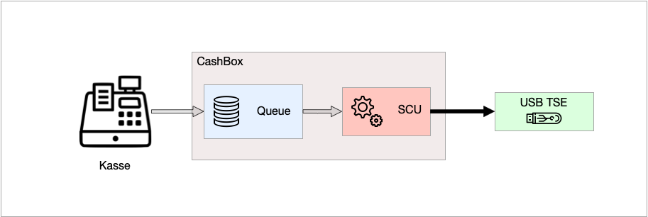

Unsere CashBox soll eine Queue und eine SCU beinhalten. Die SCU greift auf eine USB TSE zu. Konkret werden wir eine Queue konfigurieren, mit der das KassenSystem über `REST` kommuniziert und unter `localhost:1200/fiskaltrust` für das KassenSystem erreichbar ist. Die Queue legt die verarbeiteten Daten in einer `SQLite` Datenbank ab. Des Weiteren konfigurieren wir in diesem Beispiel eine SCU die über `grpc` und unter `localhost:1400` für die Queue erreichbar ist und die zum Signieren der Daten auf eine Cryptovision USB-TSE zugreift. Die TSE ist im Laufwerk `E:` eingesteckt.

**Schritt 1: Anlegen der SCU Konfiguration**

Gehen Sie im fiskaltrust.Portal auf "Konfiguration ->  TSE/Signatur-Erstellungs-Einheit". Sie gelangen zur Liste der bereits angelegten SCUs. 

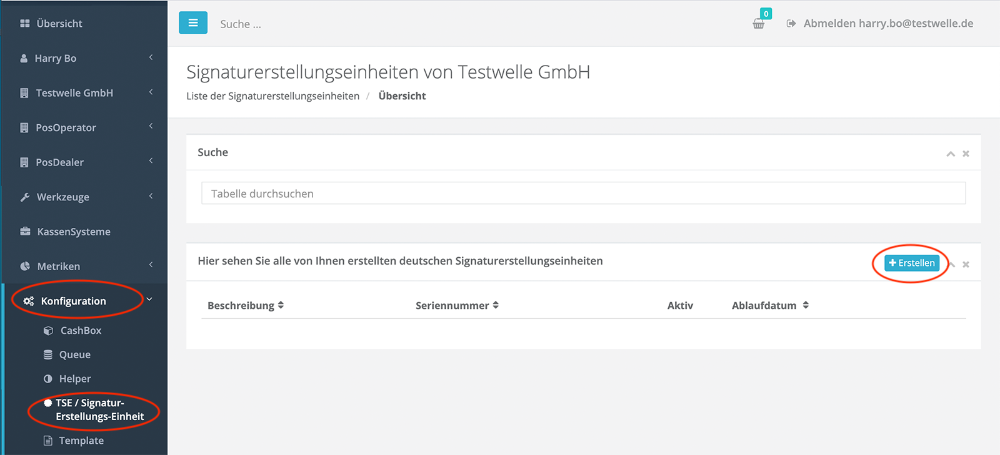

Drücken Sie nun auf den Button "+ Erstellen". Es erscheint ein Formular zum Erfassen der SCU.


1. Geben Sie hier den Namen der SCU an (z.B. "TEST SCU")
2. Wählen Sie je nach TSE das Package (Modul) aus, das die SCU verwenden soll (in unserem Beispiel verwenden wir eine CryptoVision TSE)
3. Bei der Package-Version wird automatisch die neueste gewählt
4. Geben Sie den Standort an, es wird standardmäßig automatisch der Hauptstandort vorselektiert
5. Drücken Sie "Speichern"

Die SCU wurde angelegt und wir werden nun zur zweiten Konfigurationsmaske weitergeleitet. Diese richtet sich nach dem zuvor ausgewählten Package. In unserem Beispiel müssen wir für die Cryptovision TSE den Gerätepfad angeben. Für ein anderes Package kann hier auch was anderes verlangt werden (z.B. Com-Port für eine Diebold-TSE). 


1. Tragen Sie den Gerätepfad ein (also `E:` in unserem Fall)
2. Geben Sie nun an, wie und wo die SCU für eine Queue erreichbar sein soll. Drücken Sie dazu zuerst den entsprechenden Button für die Art der Kommunikation (z.B. `grpc`) und tragen Sie danach den Pfad ein (z.B. `localhost:1401`).
3. Drücken Sie auf "Speichern und schließen" um die Angaben zu speichern und zurück zur Liste zu gelangen.

In der Liste können wir nun sehen, dass unsere SCU Konfiguration erfolgreich angelegt wurde:


**Schritt 2: Anlegen der Queue Konfiguration**

Als nächstes legen wir die Queue Konfiguration an. Dazu gehen wir auf "Konfiguration -> Queue". Die Liste der bereits angelegten Queues wird angezeigt.

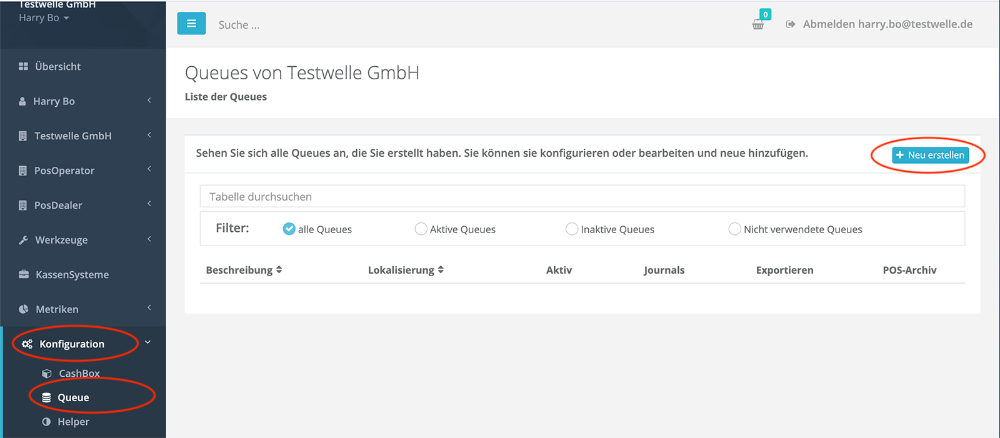

Drücken Sie nun auf den Button "Neu erstellen". Es erscheint ein Formular zum Erfassen der Queue.


1. Geben Sie hier den Namen der Queue an (z.B. "TEST QUEUE")
2. Wählen Sie aus, wie die Daten persistiert werden sollen (z.B. SQLite Datenbank). 
3. Bei der Package-Version wird automatisch die neueste gewählt

4. Geben Sie im Feld "CashBox Identification" die **Kassenseriennummer** an. Achten Sie darauf, dass diese weltweit eindeutig ist und dass es sich um einen [printable string](https://en.wikipedia.org/wiki/PrintableString) mit max. 20 Zeichen länge handelt. Die hier angegebene Kassenseriennummer wird später auch als ClientId in der TSE registriert, um die Signaturen eindeutig der Kasse zuzuordnen. Da die unterschiedlichen TSE Hersteller jeweils andere Vorgaben zur Formatierung und zur Länge der ClientId machen, haben wir uns hier auf den kleinsten gemeinsamen Nenner geeinigt ([printable string](https://en.wikipedia.org/wiki/PrintableString), max. 20 Zeichen)

5. Geben Sie den Standort an, es wird standardmäßig automatisch der Hauptstandort vorselektiert

6. Drücken Sie "Speichern"

Die Queue wurde angelegt und wir werden nun zur zweiten Konfigurationsmaske weitergeleitet. Diese richtet sich nach dem zuvor ausgewählten Persitenz-Package. In unserem Beispiel müssen wir für die SQLite Datenbank keine weiteren Angaben vornehmen, denn sie wird automatisch von der fiskaltrust.Middleware angelegt. Handelt es sich jedoch um ein anderes Package, so müssen hier entsprechende Verbindungsangaben gemacht werden. Zum Beispiel die Angabe eines Connection-String für eine MySQL Datenbank. 


1. Tragen Sie bei Bedarf die Verbindungsangaben ein (in diesem Besipiel nicht notwendig, das SQLite DB)
2. Geben Sie nun an, wie die Queue von dem KassenSystem erreichbar sein soll. Drücken Sie dazu zuerst den entsprechenden Button für die Art der Kommunikation (z.B. `http(REST)`) und tragen Sie danach den Pfad ein (z.B. `localhost:1200/fiskaltrust`).
3. Drücken Sie auf "Speichern und schließen" um die Angaben zu speichern und zurück zur Liste zu gelangen.

In der Liste können wir nun sehen, dass unsere Queue Konfiguration erfolgreich angelegt wurde:

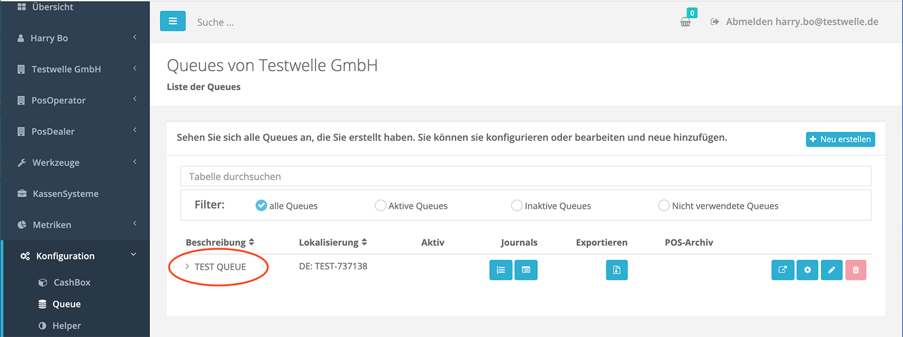


**Schritt 3: Anlegen der CashBox**

Nach dem Anlegen der SCU und der Queue legen wir als nächstes die CashBox, also den Konfigurationscontainer für die fiskaltrust.Middleware-Instanz, an. Gehen Sie dazu auf "Konfiguration->CashBox". Die Liste der bereits angelegten CashBoxen wird angezeigt.


Drücken Sie nun auf den Button "+ Hinzufügen". Es erscheint ein Formular zum Erfassen der CashBox.


1. Geben Sie hier den Namen der CashBox an (z.B. "TEST CASHBOX")

2. Geben Sie den Standort an, es wird standardmäßig automatisch der Hauptstandort vorselektiert

3. Drücken Sie "Speichern" um die Angaben zu speichern und zurück zur Liste zu gelangen.

In der Liste können wir nun sehen, dass unsere neue CashBox erfolgreich angelegt wurde:


**Schritt 4: CashBox füllen**

Nach dem Anlegen der CashBox wird diese als nächstes befüllt. In unserem Beispiel wollen wir die zuvor angelegte Queue Konfiguration und die SCU Konfiguration in die CashBox hineinlegen. Der Listeneintrag mit unserer CashBox lässt sich aufklappen. Hier können wir sehen, dass sie aktuell noch leer ist.


Um die neu angelegte CashBox zu füllen drücken Sie den "Bearbeiten per Liste" Knopf im Listeneintrag der CashBox.


Die Liste der vorhandenen Konfigurationen wird angezeigt. 

Wir können hier wählen, welche Konfigurationen wir unserem Konfigurationscontainer also in die CashBox hinzufügen möchten. Für unser Beispiel wählen wir die zuvor angelegte Queue und SCU und drücken dann den "Speichern" Button.


Zurück in der Liste können wir erneut den Listeneintrag unserer CashBox aufklappen und sehen nun, dass sie Queue und SCU beinhaltet.


**Schritt 5: Queue mit SCU verbinden**

Wie bereits oben beschrieben, müssen wir der Queue mitteilen, welche SCU sie zum Signieren der Daten verwenden soll. Wir müssen also die Queue mit der SCU "verbinden". In unserem Fall befinden sich Queue und SCU in der gleichen CashBox. Dennoch müssen wir die Verbindung anlegen. Dazu drücken wir in dem aufgeklappten Listeneintrag der CashBox den "Verbinden" Button, der rechts von der Queue angezeigt wird:


Es erscheint ein Popup mit den verfügbaren SCUs. Aus dieser Liste können wir nun unsere zuvor angelegte SCU auswählen, speichern und das Popup schließen.


Die Queue weiß nun, mit welcher SCU sie zu kommunizieren hat und wo diese erreichbar ist.

**Schritt 6: CashBox publizieren (rebuild configuration)**

Als letzten Schritt müssen wir die angelegte CashBox publizieren. Dies geschieht mit dem "Rebuild configuration" Button, der in der Listenzeile der Casbox zur Verfügung steht.


Dadurch wird die CashBox als JSON-File zum Download verfügbar gemacht. Dieses JSON-Konfigurations-File kann später von einer fiskaltrust.Middleware-Instanz heruntergeladen werden und für die Erstinitialisierung oder für ein Update genutzt werden. Im Falle eines Updates, zum Beispiel Update der SCU Package Version aufgrund einer Gesetzesänderung, wird die Änderung in der CashBox erst zur Verfügung gestellt, nachdem der "Rebuild configuration" Button gedrückt wurde. Wird daraufhin die fiskaltrust.Middleware-Instanz, der diese CashBox zugeordnet ist, neu gestartet, so lädt sie die neue Konfiguration und aktualisiert sich selbst automatisch, z.B. indem sie das neue Package herunterlädt und verwendet. 

## Service starten und testen

Zum Testen des Service, also einer fiskaltrust.Middleware-Instanz, laden wir den sogenannten "Launcher" herunter. Dies können wir in dem Listeneintrag der zuvor angelegten CashBox tun. Drücken Sie dazu den "Download .NET Launcher" Button. 


Sie erhalten ein Zip-komprimierten Ordner, den sie auf der Kasse entpacken können. Entpacken Sie das Zip-File. 


Der daraus resultierende Ordner kann bei Bedarf auch umbenannt werden. In dem Ordner befinden sich der Launcher `fiskaltrust.exe`, der Service repräsentiert durch die `.dll` Files, eine Konfigurations-Datei namens `fiskaltrust.exe.config` und drei Command-Files:

- `install-service.cmd`
- `uninstall-service.cmd`
- `test.cmd`

Die Command-Files können zum parametrisierten Starten oder Stoppen des Service verwendet werden. Sie führen die `fiskaltrust.exe` mit Angabe entsprechenden Parameter aus. der Inhalt des `install-service.cmd` File ist zum Beispiel wie folgt:

`cd /d "%~dp0%"`
`fiskaltrust -cashboxid=259c5a7b-fc44-40d6-af7b-73fde0943ec4 -accesstoken=BL...8D6o= -sandbox -i -servicename=fiskaltrust-259c5a7b-fc44-40d6-af7b-73fde0943ec4`
`timeout 15`

`fiskaltrust.exe` wird also mit der `cashobxid` "259c.." gestartet. Dadurch weiß die gestartete fiskaltrust.Middleware-Instanz aus welchem Konfigurationscontainer (CashBox) sie sich initialisieren soll. Die `cashboxid` ist die ID der CashBox und kann im fiskaltrust.Portal im aufgeklappten Listeneintrag der CashBox eingesehen werden:

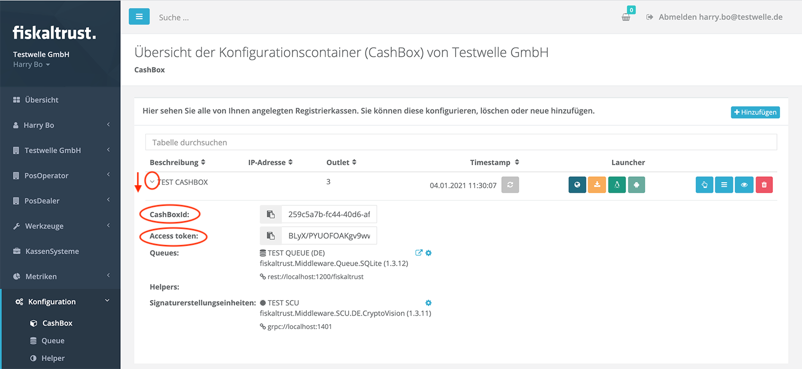

Um die CashBox aus dem fiskaltrust.Portal laden zu können benötigt der Service eine Zugriffsberechtigung. Diese wird über den Parameter `accesstoken` angegeben. Der Wert ist ebenfalls im fiskaltrust.Portal im aufgeklappten Listeneintrag der CashBox zu finden (s.o.).

Der Parameter `sandbox` gibt an, dass auf das Sandbox-Portal zugegriffen werden soll. Der Parameter `i` gibt an, dass die fiskaltrust.Middleware-Instanz als (Windows) Service installiert und gestartet werden soll. Der Parameter `servicename` setzt den Namen des (Windows) Service.

Die vollständige Liste der zur Verfügung stehenden Parameter und weitere technische Angaben zur Installation des Service finden Sie in unserer IPOS Interface-Dokumentation im Kapitel [Installation](https://docs.fiskaltrust.cloud/doc/interface-doc/doc/general/installation/installation.html).

Zum Testen des Service können wir das Command-File `test.cmd` verwenden. Der Inhalt sieht wie folgt aus:

`cd /d "%~dp0%"`
`fiskaltrust -cashboxid=259c5a7b-fc44-40d6-af7b-73fde0943ec4 -accesstoken=BL...8D6o= -sandbox -test`

Die fiskaltrust.Middleware-Instanz wird also nicht als (Windows) Service installiert und gestartet, sondern stattdessen mit Hilfe des Parameters `test` direkt im Testmodus in der Konsole (cmd) gestartet. Der Vorteil hier ist, dass wir direkt in der Konsole die Logmeldungen sehen können und entsprechend reagieren können. Um eine erweiterte Logausgabe zu aktivieren können wir das `test.cmd` File vor dem Ausführen editieren und dort noch den Parameter `verbosity` mit dem Wert `Debug` anhängen:

`cd /d "%~dp0%"`
`fiskaltrust -cashboxid=259c5a7b-fc44-40d6-af7b-73fde0943ec4 -accesstoken=BL...8D6o= -sandbox -test -verbosity=Debug`

Speichern und als Administrator starten:


Es erscheint eine Konsole, in der die fisklatrust.Middleware Instanz gestartet wird. Wir können hier sehen, was genau beim Start passiert und bei etwaigen Fehler entsprechende Korrekturen (z.B. in der CashBox oder in beim Anschluss der TSE) vornehmen.


Nun können Sie versuchen aus dem KassenSystem Anfragen an die gestartete fiskaltrust.Middleware-Instanz zu senden. Als KassenHändler werden Ihnen im KassenSystem entsprechende Knöpfe zur Verfügung stehen. 

In unserem Beispiel simulieren wir ein KassenSystem mit Hilfe von [Postman](https://www.postman.com/). Postman kann Anfragen an die Queue über `REST` senden. Dazu verwenden wir unsere Collection aus dem fiskaltrust [middleware-demo-postman github repository](https://github.com/fiskaltrust/middleware-demo-postman). In dem Repository findet sich auch die Anleitung zur Konfiguration der Postman-Collection. Wichtig hierbei ist die Angabe des Endpoint an der die Queue erreichbar ist und die Angabe der CashBoxId als Werte für die bereits angelegten Variablen:


### Verfügbarkeit der Queue testen

Als erstes senden wir einen `echo` Request um die Verfügbarkeit der Queue zu überprüfen. Als KassenHändler wird Ihnen im KassenSystem ein entsprechender Knopf zur Verfügung stehen. In unserem Bespiel verwenden wir den "Echo" Request aus der oben beschriebenen Postman-Collection:


Die Queue antwortet und wir wissen nun, das die fiskaltrust.Middleware-Instanz erreichbar ist und für weitere Anfragen zur Verfügung steht. Die Anfrage und Ihre Verarbeitung können wir auch in der zuvor gestarteten Konsole als Log-Nachricht sehen:


### Initialisierung der fiskaltrust.Middleware-Instanz über einen Initialisierungs-Beleg

Als nächstes senden wir einen "Initialisierungs-Beleg". Als KassenHändler wird Ihnen im KassenSystem ein entsprechender Knopf zur Verfügung stehen. In unserem Bespiel verwenden wir wieder die oben beschriebene Postman-Collection. Der Initialisierungs-Beleg sorgt dafür, dass die fiskaltrust.Middleware initialisiert wird, sich als Client bei der TSE registriert und falls die TSE noch nicht initialisiert ist, die TSE ebenfalls in Betrieb nimmt.


In der Antwort und in der Konsole können wir nun sehen, dass unsere Queue als Client in der TSE registriert wurde.

### Abrechnungs-Beleg senden

Als nächste können wir einen Beleg zum Abrechnen eines Einkaufs senden. Als KassenHändler wird Ihnen im KassenSystem entsprechende Funktionalität zur Verfügung stehen. In unserem Beispiel verwenden wir wieder die oben beschriebene Postman-Collection. 


Die fiskaltrust.Middleware bearbeitet die Anfrage, und sendet eine Antwort zurück, die wichtige Belegdaten, inklusive der benötigten Signaturen enthält. Im Erfolgfall werden diese vom KassenSystem auf den Beleg gedruckt.

### Verbindung mit der fiskaltrust.Cloud überprüfen

Auch im fiskaltrust.Portal können wir die oben abgesetzten Anfrage und den daraus resultierenden Beleg einsehen, da diese über den Helipad Helper alle 5 Minuten hochgeladen werden. Gehen Sie dazu auf "Konfiguration->Queue" und drücken Sie den "ReceiptJournal" Button im Listeneintrag der Queue.


Es erscheint eine Übersicht der verarbeiteten Beleganfragen:


Hinweis: 

Sollten die Belege hier nicht erscheinen, kann es sein, dass die Kommunikation der fiskaltrust.Middleware mit dem Server nicht geklappt hat. Überprüfen Sie in diesem Fall zuerst ob bereits 5 Minuten seit dem Absetzen der Anfragen vergangen sind. Sollte dies der Fall sein, so überprüfen Sie bitte die Logmeldungen in der Konsole. Es kann sein, dass Sie zuerst entsprechende Firewall Ports freigeben müssen.

Drücken Sie nun als nächstes auf den Button mit dem Auge-Symbol in der Zeile mit dem zuvor gesendeten Abrechnungs-Beleg (s.o.). Sie können nun eine beispielhafte Darstellung des Belegs einsehen. Zudem werden die konkrete Anfrage und die Antwort an das KassenSystem angezeigt:

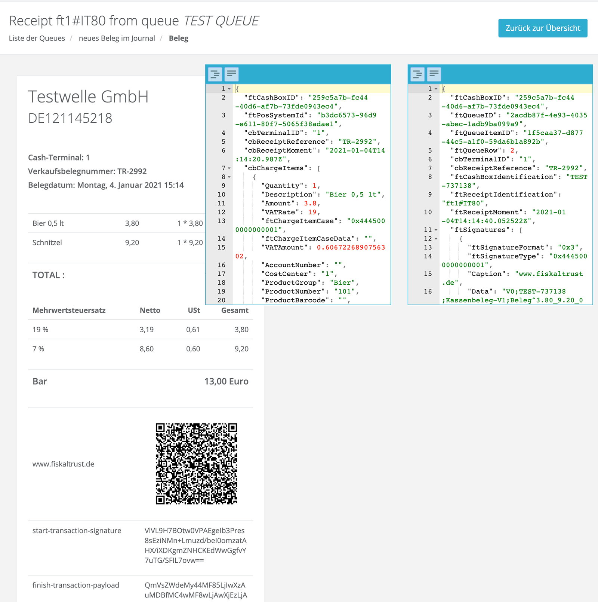


### Datenexport testen

Ein Datenexport kann lokal über die fiskaltrust.Middleware oder über das fiskaltrust.Portal vorgenommen werden. Der lokale Export von Daten direkt aus der fiskaltrust.Middleware ist lizenzkostenfrei. Der Export über das fiskaltrust.Portal ist kostenpflichtig und wir über das fiskaltrust Produkt POSArchiv pro KassenBetreiber und Kasse freigeschalten Das Produkt POSArchiv ist auch in unseren Sorglos-Paketen enthalten und bezieht sich dort auf alle Kassen des Standorts (ist jedoch auf eine Maximalanzahl an Kassen limitiert - siehe dazu auch die aktuelle Produktbeschreibung).

#### Datenexport lokal

Es können folgende Daten direkt lokal über die fiskaltrust.Middleware exportiert werden:

- Aktionsjournal im internen fiskaltrust Format (JSON)
- Belegjournal im internen fiskaltrust Format (JSON)
- QueueItemesjournal im internen fiskaltrust Format (JSON)
- DSFinV-K- Ein DSFinV-K (Digitale Schnittstelle der Finanzverwaltung für Kassensysteme) kompatibler Export der an die Queue gesendeten Daten. Die Daten werden in mehreren CSV-Dateien aggregiert, nach DSFinV-K 2.2
- TAR-File Export der TSE Daten in der TAR-Datei (einem Archiv zum Verpacken von Dateien) aggregiert, dass z.B. mit 7-zip geöffnet werden kann.

Der Export bezieht sich immer auf eine Queue (mit Ausnahme des TSE-TAR, siehe Hinweis weiter unten). Der Datenexport aus der fiskaltrust.Middleware wird vom KassenHersteller über das KassenSystem zur Verfügung gestellt. Dazu verwendet das KassenSystem die `journal` Funktion der IPOS Schnittstelle, die von der fiskaltrust.Middleware zur Verfügung gestellt wird. Als KassenHändler stehen Ihnen dann entsprechende Funktionalität an der Kasse zur Verfügung. Bitte testen Sie den Datenexport in diesem Fall direkt mit dem KassenSystem. Beachten Sie bitte dabei auch die weiter unten dargestellten Hinweise zum DSFinV-K Export und zu dem TAR-File Export.

#### Hinweise zum DSFinV-K Export

Der DSFinV-K Export bezieht sich immer auf einen abgeschossenen Tag. Er erfordert, dass jeder Tag mit einen sogenannten Tagesabschlußbeleg abegeschlossen wird. Der Tagesabschlußbelegt muss an die fiskaltrust.Middleware über das KassenSystem gesendet werden. Als KassenHändler stellt Ihnen das KassenSystem einen entsprechenden Knopf zur Verfügung.  

#### Hinweise zum TAR-File Export

Der Tar-File Export bezieht sich auf alle Daten der TSE, auch wenn die TSE von mehreren Queues verwendet wird. Der TSE-TAR Export beinhaltet also die Daten aller Queues, die die selbe TSE verwenden. 

Der TAR Export wird beim daily-closing Beleg (Tagesabschlußbeleg) automatisch von der fiskaltrust.Middleware getriggert. Die Daten werden dabei in Datenbank der ausführenden Queue übertragen und aus der TSE gelöscht.  Des Weiteren werden die Daten in die fiskaltrust.Cloud hochgeladen wo sie dann im fiskaltrust.Portal nach Aktivierung des Produkts POSArchiv zur Verfügung stehen.

Deshalb empfehlen wir, im Falle, dass mehrere Queues die selbe TSE verwenden, eine "führende Queue" zu definieren, die beim daily-closing Beleg die TSE Daten bekommt. Für die anderen Queues die auf die selbe TSE zugreifen, sollten KassenHersteller dafür sorgen, dass das KassenSystem beim daily-closing Beleg das receipt case flag [0x0000000004000000](https://docs.fiskaltrust.cloud/doc/interface-doc/doc/appendix-de-kassensichv/reference-tables/type-of-receipt-ftreceiptcase.html#ftreceiptcaseflag) verwenden. Das verhindert den automatischen TAR Export durch die fiskaltrust.Middleware und damit sind die Daten nicht auf unterschiedliche Queues verteilt, sondern landen immer nur in der führenden Queue. Als KassenHändler sollten Ihnen für diesen Fall zwei unterschiedliche Funktionen im KassenSystem zur Verfügung stehen (z.B. Tagesabschluß mit automatischem TAR-File Export - für die führende Queue - und Tagesabschuß ohne automatischem TAR-File Export für die anderen Queues, die dieselbe TSE verwenden).

Wir arbeiten außerdem gerade an einem Standortbasierten Export im fiskaltrust.Portal, der dann zu einer Handling-Vereinfachung führen wird.

Der direkte Export der TSE-TAR Daten kann vom KassenSystem über die Journalfunktion der IPOS-Schnittstelle von der Kasse aufgerufen werden.

Über den ftJournalType kann dabei zwischen zwei Varianten unterschieden werden:

[0x4445000000000001](https://docs.fiskaltrust.cloud/doc/interface-doc/doc/appendix-de-kassensichv/reference-tables/type-of-journal-ftjournaltype.html) - exportiert die TAR-TSE Daten, die sich aktuell in der TSE befinden (D.h. vom letzten daily-closing bis zum Zeitpunkt des Aufrufs)
[0x4445000000000003](https://docs.fiskaltrust.cloud/doc/interface-doc/doc/appendix-de-kassensichv/reference-tables/type-of-journal-ftjournaltype.html) - exportiert die TAR-TSE Daten, die sich in der Datenbank der Queue befinden.

 Als KassenHändler sollten Ihnen auch hierzu entsprechende Knöpfe im KassenSystem zur Verfügung stehen.

#### Datenexport über das fiskaltrust.Portal

Es können folgende Daten pro Queue exportiert werden:

- Vollständiger Export (XML oder CSV)  - Export aller Daten, die an die Queue gesendet wurden. Die Daten werden in Form einer XML-Datei  oder CSV-Datei aggregiert.
- Aktionsjournal im internen fiskaltrust Format (JSON)
- Belegjournal im internen fiskaltrust Format (JSON)
- DSFinV-K- Ein DSFinV-K (Digitale Schnittstelle der Finanzverwaltung für Kassensysteme) kompatibler Export der an die Queue gesendeten Daten. Die Daten werden in mehreren CSV-Dateien aggregiert, nach DSFinV-K 2.2
- TAR-File Export der TSE Daten in der TAR-Datei (einem Archiv zum Verpacken von Dateien) aggregiert, dass z.B. mit 7-zip geöffnet werden kann.


Um den Datenexport über das fiskaltrust.Portal zu testen können Sie wie folgt vorgehen:

##### Belegjournal oder Actionjournal exportieren

Gehen Sie im fiskaltrust.Portal auf den Menüpunkt "Konfiguration -> Queue". Sie finden hier für jede Queue einen Listeneintrag. Im Listeneintrag der Queue befinden sich die Buttons zum Exportieren der Journale:


##### Vollständiger Export (XML oder CSV), DSFinV-K Export oder TAR-File Export

Gehen Sie dazu im fiskaltrust.Portal zuerst auf den Menüpunkt "Konfiguration -> Queue". Sie finden hier für jede Queue einen Listeneintrag. Im Listeneintrag der Queue befindet sich einen "Exportieren" Button:


Sie gelangen zur Export-Ansicht für die gewählte Queue. Hier können Sie die Art des Exports wählen und den Export antriggern:


Setzen Sie in dem oberen Filterbereich die gewünschten Filter, wählen Sie danach z.B. "Vollständiger Export (CSV)" und drücken Sie im Anschluss den "Export starten" Button ganz unten. Sie werden zur Liste der angetriggerten Exports weitergeleitet, wo ihnen angezeigt wird, dass der Export sich gerade in Bearbeitung befindet. Sobald der gewünschte Export zur Verfügung steht können Sie den Listeneintrag aufklappen und den fertigen Export downloaden.


Die oben beschriebene Vorgehensweise kann analog zu allen der Export-Ansicht angebotenen Export-Formate durchgeführt werden. Achten Sie beim Testen des DSFinV-K und TAR-File Export darauf, dass auch ein dazugehöriger Tagesabschlußbeleg an die fiskaltrust.Middelware vom KassenSystem gesendet wurde.


### Schlußwort

In den oberen Kapitel haben wir beschrieben wie die fiskaltrust.Middleware aufgebaut ist, wie die einzelnen Instanzen manuell über das fiskaltrust.Portal konfiguriert werden kann und wie der Service gestartet und getestet werden kann. Als nächstes möchten wir Ihnen als Inspiration für den Rollout ein einige mögliche Rollout-Szenarien vorstellen. Diese zeigen, wie flexibel die fiskaltrust.Middleware am Standort des Betreibers eingesetzt werden kann. Nach der Präsentation verschiedener Rollout-Szenarien gehen wir dann auf mögliche Automatisierungsoptionen für den Massenrollout ein. 

## Rollout Szenarien

### Einleitung
Instanzen der fiskaltrust.Middleware können je nach Gegebenheit bzw. Szenario unterschiedlich konfiguriert werden und zusammenarbeiten. Jedes, in diesem Kapitel vorgestellte Szenario, ist auf einen Standort bezogen. Folgende Grundvoraussetzungen sind dabei unabhängig vom Szenario zu beachten:

- Pro Standort muss mindestens eine SCU inkl. TSE zugeordnet sein. Die TSE kann entweder eine Hardware-TSE vor Ort sein, oder eine zertifizierte Cloud-TSE.
- Eine TSE kann immer nur von einem Unternehmen und daher von einem KassenBetreiber (Account) im fiskaltrust.Portal genutzt werden. Selbst wenn sich zwei Unternehmen einen Standort teilen, müssen trotzdem zwei TSEs genutzt werden.
- Jede Queue muss dem Finanzamt als elektronisches Kassen- oder Aufzeichnungssystem (Kasse) gemeldet werden.
- Alle Queues, SCUs und TSEs müssen sich im sogenannten "operational environment" des KassenBetreibers befinden. Eine Ausnahme stellt die Cloud-Komponente einer zertifizierten Cloud-TSE dar. Diese befindet sich im Rechenzentrum des Cloud-TSE Anbieters.
- Jeder Queue kann nur eine SCU zugeordnet werden und jede SCU kann nur für eine TSE zuständig sein. D.h. jede Kasse kann nur eine TSE verwenden.
- Pro Kasse können mehrere Terminals betrieben werden. (Ein Terminal ist ein Gerät ohne Kassenfunktion).

  

*Info zur Cloud-TSE*
Bei einer Cloud-TSE läuft eine Komponente im Rechenzentrum des Cloud-TSE Anbieters. Ist diese TSE Komponente nicht mehr erreichbar, wechselt die fiskaltrust.Middleware in den Ausfallsmodus. Bei der Nutzung von Cloud-TSEs möchten wir zusätzlich auf unsere [Fair-Use-Policy](https://github.com/fiskaltrust/productdescription-de-doc/blob/master/for-posoperators/tse-fiskaly-fair-use-policy.md) hinweisen.

 *Info zur Hardware-TSE*
Grundsätzlich werden Hardware-TSE per micro SD-Karte oder per USB-Anschluss direkt an die Kasse angeschlossen.


### Eine TSE pro Kasse
Aus technischer Sicht ist dies das einfachste Szenario, benötigt allerdings eine höhere Anzahl an TSEs, da für jede Kasse eine eigene TSE eingesetzt wird. Ein Vorteil dieser Lösung ist, dass wenn eine TSE ausfällt oder verloren geht, andere Kassen nicht betroffen sind. Ein weiterer Vorteil besteht darin, dass Performanceengpässe vermieden werden, weil jede Kasse ihre eigene TSE nutzt und somit nur die Requests dieser einen Kasse von der TSE verearbeitet bzw. signiert werden müssen.

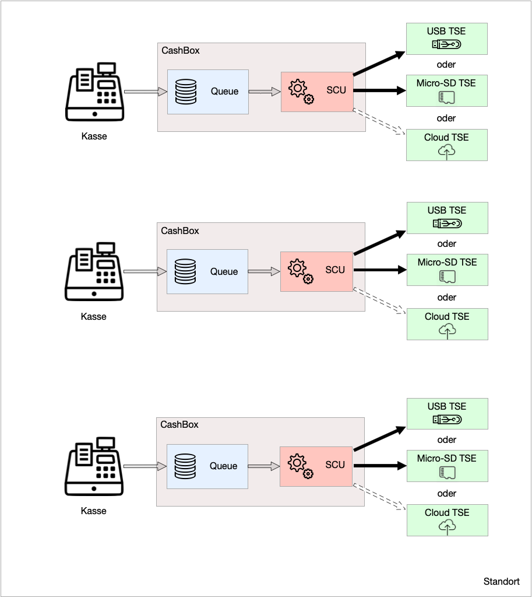


### Hardware-TSE(s) am lokalen Server für mehrere Kassen

Auf jeder Kasse und auf dem lokalen Server läuft die fiskaltrust.Middleware. Die Hardware-TSE wird an den lokalen Server (z.B. per USB) angeschlossen. Die CashBox des Servers konfiguriert die fiskaltrust.Middleware-Instanz mit einer SCU. Die für den Server konfigurierte SCU greift auf eine Hardware-TSE zu. Die CashBoxen der einzelnen Kassen sind so zusammengestellt, dass deren fiskaltrust.Middleware-Instanz nur mit einer Queue ausgestattet wird. Die hier eingesetzten Queues verbinden sich mit der SCU des Server. Dieses Szenario ermöglicht eine Einsparung von TSEs. Da jedoch hierbei alle Requests über die SCU des Server laufen müssen, wird der Server zum Bottleneck. Auch die TSE wird zum Bottleneck. Beim Ausfall des Server oder der TSE sind alle Kassen davon betroffen. Des Weiteren kann es in diesem Szenario zu [Performanceengpässen](#performanceempfehlung) in der Hardware-TSE kommen. 


Sollten Sie sich für dieses Szenario entscheiden, empfehlen wir bei einer großen Anzahl von Requests den Einsatz einer oder mehrerer zusätzlichen TSEs. Dies wird im unteren Bild beispielhaft visualisiert.


### Hardware-TSE an der Hauptkasse für mehrere zusätzliche Kassen
Auf jeder Kasse läuft die fiskaltrust.Middleware. Die CashBox der Hauptkasse konfiguriert die fiskaltrust.Middleware-Instanz mit einer Queue und einer SCU. Die für die Hauptkasse konfigurierte SCU greift auf eine TSE zu. Die CashBoxen der anderen Kassen sind so konfiguriert, dass deren fiskaltrust.Middleware-Instanzen nur mit einer Queue ausgestattet werden. Die hier eingesetzten Queues verbinden sich mit der SCU der Hauptkasse. Dieses Szenario ermöglicht eine Einsparung von TSEs. Da jedoch hierbei alle Requests über die SCU der Hauptkasse laufen müssen, wird die Hauptkasse zum Bottleneck. Auch die Hardware-TSE wird zum Bottleneck. Beim Ausfall der Hauptkasse oder der Hardware-TSE sind alle anderen Kassen davon betroffen. Des Weiteren kann es in diesem Szenario zu [Performanceengpässen](#performanceempfehlung) in der TSE kommen. Sollten Sie sich für dieses Szenario entscheiden, empfehlen wir bei einer großen Anzahl von Requests den Einsatz einer oder mehrerer zusätzlichen TSEs.


### Eine Cloud-TSE für mehrere Kassen
Auf jeder Kasse läuft die fiskaltrust.Middleware. Die CashBox jeder Kasse konfiguriert die fiskaltrust.Middleware-Instanz mit einer eigenen Queue und einer eigenen SCU. Jede SCU greift auf die gleiche Cloud-TSE zu. Dieses Szenario ermöglicht eine Einsparung von Cloud-TSEs. Ein Vorteil hier ist, dass die SCU nicht zum Bottleneck wird, da jede Kasse ihre eigene SCU hat. Da jedoch hierbei alle Requests an die gleiche Cloud-TSE gesendet werden, wird die TSE zum Bottleneck. Des Weiteren sind hierbei ebenfalls sowohl mögliche [Performanceengpässe](#performanceempfehlung) in der Cloud-TSE zu berücksichtigen als auch unsere [Fair-Use-Policy](https://github.com/fiskaltrust/productdescription-de-doc/blob/master/for-posoperators/tse-fiskaly-fair-use-policy.md).

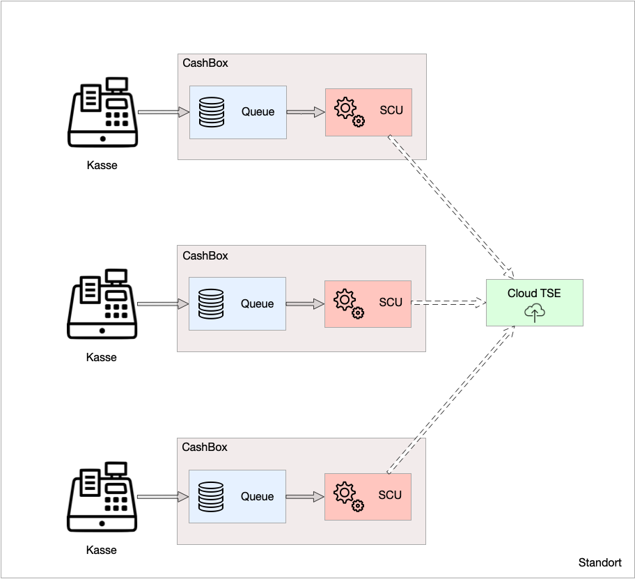

### Rollout-Szenario mit Terminals
Terminals sind Eingabegeräte wie Tablets, Handhelds oder ähnliches (ohne Kassenfunktion), bei denen es nicht möglich ist eine Hardware-TSE anzuschließen bzw. die fiskaltrust.Middleware am Gerät selbst zu installieren. In diesem Fall wird die fiskaltrust.Middleware an einer Kasse oder an einem Server betrieben und ist stets für die Terminals erreichbar. Die Terminals dienen nur als Eingabegeräte und verbinden sich mit dem Server oder mit der Kasse. Bei vielen gleichzeitigen Requests kann es zu [Performanceengpässen](#performanceempfehlung) in der TSE kommen. Sollten Sie ich für dieses Szenario entscheiden, empfehlen wir bei einer großen Anzahl von Requests den Einsatz mehrerer Kassen mit zusätzlichen TSEs (alternativ: mehrere fiskaltrust.Middleware-Instanzen mit eigener SCU und TSE auf dem Server).


Eine weitere mögliche Variante dieses Szenario ist die Zuordnung jedes Terminals zu einer eigenen Queue.


### Rechenzentrum als operational environment
Falls die Kasse in einem Rechenzentrum betrieben wird und die Terminals ohne (Internet-)Verbindung zu diesem nicht funktionsfähig sind, kann das Rechenzentrum unter bestimmten Voraussetzungen als "operational environment" angenommen werden. Die fiskaltrust.Middleware sollte in diesem Fall vollständig im Rechenzentrum betrieben werden. In diesem Szenario verbinden sich die Terminals über das Online KassenSystem zur fiskaltrust.Middleware im Rechenzentrum.
Im Falle eines Ausfalls der (Internet-)Verbindung ist es allerdings so, dass die fiskaltrust.Middleware nicht mehr erreicht werden kann und somit keine von der fiskaltrust.Middleware erzeugten Signaturen auf die Belege gedruckt werden können. Bei Interesse an dieser Lösung (BYOD - Bring your own datacenter), bei der die fiskaltrust.Middleware im Rechenzentrum des KassenBetreibers läuft, finden Sie weitere Informationen in unserem [BYOD github repository](https://github.com/fiskaltrust/product-de-bring-your-own-datacenter). 


### Anbindungsvarianten der TSE and die SCU

Für folgende Anbindungsvarianten haben wir eine Legende vorbereitet, die die Bedeutung der einzelnen Pfeile aufzeigt:


#### Kasse mit Hardware-TSE
In der klassischen Anbindungsvariante befindet sich das KassenSystem in der lokalen Umgebung des Standorts und eine Hardware-TSE ist direkt mit dem KassenSystem verbunden z.B. über USB oder micro SD.


#### Netzwerk-Drucker mit Hardware-TSE
Eine weitere Variante in der lokalen Umgebung stellt die Verwendung eines Netzwerk-Druckers mit Hardware-TSE dar. Dabei kann die Hardware-TSE direkt in dem Drucker integriert oder per USB angeschlossen sein. Eine oder mehrere Kassen verwenden den Drucker.

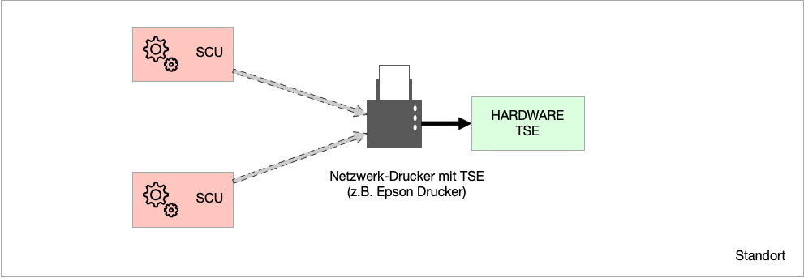

#### Lokaler TSE-Server mit Hardware-TSEs
Die dritte Anbindungsvariante in der lokalen Umgebung wird über einen TSE Server im lokalen Netzwerk realisiert. An einen TSE-Server können mehrere Hardware-TSE angeschlossen werden. Mehrere Kassen greifen über Ihre SCU auf den TSE-Server zu.

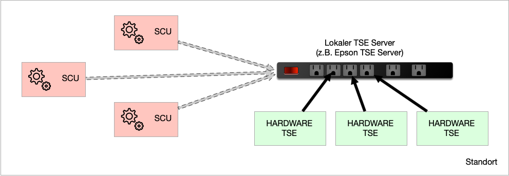

#### Kasse mit Cloud-TSE
Auf eine Cloud-TSE muss über das Internet zugegriffen werden. In folgendem Szenario greift eine Kasse mit Hilfe der SCU auf eine Cloud-TSE über das Internet zu.


#### KassenSystem im Rechenzentrum des Betreibers mit Cloud-TSE

Auch hier greift das KassenSystem mit Hilfe der fikalterust SCU über das Internet auf eine Cloud-TSEs zu. In der lokalen Umgebung befinden sich lediglich Terminals ohne Kassenfunktion die über das Internet auf das elektronische KassenSystem im Rechenzentrum des Betreibers zugreifen.


### Lösungsvorschläge zur Virtualisierung innerhalb eines Standortes

Bei einer Virtualisierung des elektronischen Kassen- oder Aufzeichnunsgsystem inklusive fiskaltrust.Middleware treten erfahrungsgemäß Probleme bei Zugriff auf eine direkt am lokalen Server angebundene Hardware-TSE über USB oder als micro SD auf. Eine Ausnahme stellt hierbei die Diebold-Nixdorf-TSE dar, da die Kommunikation mit dieser über COM-Port stattfindet. Aufgrund der zuvor genannten Zugriffsprobleme, haben wir in folgenden Skizzen Lösungssvorschläge für dieses Szenario dargestellt. Statt der Anbindung einer Hardware-TSE direkt am lokalen Server empfehlen wir folgende Optionen:

#### SCU ist innerhalb der virtuellen Instanz

- Anbindung an einen lokale Netzwerk-Drucker mit TSE
- Anbindung an einen TSE-Server im lokalen Netzwerk
- Anbindung von Cloud-TSEs (sobald zertifiziert)
- Anbindung an eine Diebold-Nixdorf Hardware-TSE, da die Kommunikation hierbei über COM-Port stattfindet


#### SCU ist außerhalb der virtuellen Instanz

Eine fiskaltrust.Middleware läuft bei dieser Option auf einem zweiten lokaler Server. Sie wird nicht in der virtualisierten Umgebung betrieben. Die dazu verwendete CashBox konfiguriert lediglich eine SCU, die auf die Hardware-TSE zugreift. Die Hardware-TSE wiederum, wird direkt an diesen, zweiten Server, per USB oder micro-SD angeschlossen. Im ersten Server, in dem die virtuellen Instanzen laufen, konfigurieren die eingesetzen CashBoxen die fiskaltrust.Middelware-Instanzen so, dass sie jeweils nur eine Queue betreiben, die auf die SCU im zweiten Server zugreift.


Eine mögliche Optimierung der oben beschriebenen Option könnte sein, dass die fiskaltrust.Middleware, die die SCU betreibt auf dem gleichen Server läuft wie die virtuellen Instanzen, jedoch nicht virtualisiert ist. Diese kann dann auch auf die Hardware-TSE zugreifen.


### Performanceempfehlung
Bei internen Tests haben wir festgestellt, dass 3 Signaturen pro Sekunde von jeder TSE gut verarbeitet werden können. Bei mehr als 3 Signaturen pro Sekunde kommt es zu Verzögerungen. Bitte achten Sie darauf, dass bei einem implicit-Flow 2 Signaturen pro Request abgesetzt werden. Wir empfehlen deshalb bei einer zu erwartenden höheren Menge an Signaturen der TSE pro Sekunde entsprechend zusätzliche TSEs bei der Planung zu berücksichtigen. 

### Schlußwort

## Automatisierung des Rollout

Dieses Kapitel soll beim Rollout-Prozess unterstützen indem es Möglichkeiten der Vereinfachung und Optimierung des Rollouts durch Automatisierung aufzeigt. 

### Einleitung

Jede fiskaltrust.Middleware-Instanz wird mit einer sogenannten CashBox konfiguriert. Dieser Konfigurationscontainer wird zusammen mit der fiskaltrust.Middleware beim KassenBetreiber ausgerollt. Dazu wird zum Beispiel der Launcher aus dem Portal heruntergeladen und in der Kasse gestartet. Der heruntergeladene Launcher beinhaltet die fiskaltrust.Middleware und ihre Konfiguration in Form einer CashBox. Die CashBox beinhaltet hauptsächlich die Konfigurationen der Queue und der SCU kann aber auch Helperkonfigurationen beinhalten. 


In den enthaltenen Konfigurationen sind zum Beispiel Kommunikations-Endpunkte, Datenbankzugriff, TSE-Zugriff usw. definiert. Im Normallfall wird eine solche CashBox pro Kasse benötigt. Ein Rollout mit vielen Kassen ist daher bei einer manuellen Vorgehensweise sehr zeitintensiv, da grundsätzlich für jede Kasse eine eigene CashBox im Portal angelegt, zusammengestellt und publiziert werden muss. Des Weiteren muss der Launcher heruntergeladen werden und in der Kasse ausgeführt werden. 

Um diesen Prozess zu optimieren stellt fiskaltrust diverse Tools zur Verfügung. Eine zentrale Rolle spielen dabei die Möglichkeit des Templating zum Anlegen von CashBoxen und die Möglichkeit zum automatisierten Ausführen der Templates mit Hilfe der fiskaltrust Portal-API. 

Im Folgenden gehen wir auf diese und andere Möglichkeiten der Optimierung ein und zeigen auf, wie Sie als KassenHändler je nach Bedarf davon Gebrauch machen können.


### Überblick manueller Prozess

Wie bereits in der Einleitung erwähnt wird grundsätzlich pro Kasse eine CashBox benötigt. Im Normalfall wird hier die Konfiguration einer Queue und einer SCU vorgenommen und diese werden miteinander verknüpft. 

Es existieren auch andere Szenarien (siehe dazu [Rollout-Szenarien](./README.md#rollout-szenarien ) auf die wir jedoch erst später eingehen. Die Konfiguration der CashBox ist im Kapitel [Konfiguration der fiskaltrust.Middleware](./README.md#konfiguration-der-fiskaltrustmiddleware) beschrieben.

Sobald die CashBox für die Kasse im Portal angelegt, konfiguriert und zusammengestellt wurde, kann der Launcher aus dem fiskaltrust.Portal bereits heruntergeladen werden und auf der Kasse gestartet werden. Sobald der Launcher zum ersten mal gestartet wird, wird die enthaltene Konfiguration angewendet. Dadurch ist die Middleware bereit und wird im nächsten Schritt vom Launcher gestartet. 

D.h. im manuellen Prozess sind beim Rollout mindestens folgende initialen Schritte für jede Kasse vorzunehmen:

1. Anlegen und Konfiguration der Queue
2. Anlegen und Konfiguration der SCU
3. Verknüpfen der Queue mit der SCU
4. Erstellen und konfigurieren der CashBox
5. Rebuild Configuration für die CashBox (Zusammenbauen/Aktualisieren der CashBox)
6. Download des Launcher
7. Starten des Launcher

Möchte man später die Konfiguration updaten (z.B. eine neue SCU Package Version verwenden), dann sind folgende Schritte vorzunehmen:

1. Update der betroffenen Konfiguration im Portal (z.B. SCU Konfiguration)
2. Rebuild Configuration für die CashBox im Portal (Zusammenbauen/Aktualisieren der CashBox)
3. Stoppen der Middleware und Neustart des Launchers an der Kasse. 

Der Launcher lädt daraufhin automatisch die neue Version der CashBox, wendet diese an und startet die fiskaltrust.Middleware mit der neuen Konfiguration.

Bei einer großen Menge von Kassen ist der initiale Rollout sehr zeitaufwendig, wenn er mit Hilfe der oben beschriebenen, manuellen Prozessen vorgenommen werden. 


### Templating zum Anlegen von CashBoxen

Beim Templating besteht die Möglichkeit mit Hilfe eines Konfigurations-Template automatisiert CashBoxen für den KassenBetreiber anzulegen. Es wird dafür ein Template vorbereitet und für den KassenBetreiber im fiskaltrust.Portal hinterlegt. Daraufhin erscheint das Template im fisklatrust.Shop innerhalb des Accounts des KassenBetreibers als kostenloses Produkt. Es kann dort in beliebiger Menge ausgecheckt werden. Die Menge stellt dabei die Anzahl der CashBoxen dar, die automatisch generiert werden sollen. Sobald der Checkout-Prozess abgeschlossen ist, wird vom fiskaltrust.Portal durch Anwendung des Templates die entsprechende Anzahl von CashBoxen automatisch generiert und im Account des KassenBetreiber hinterlegt. 

Im Folgenden werden die einzelnen Schritte des oben beschriebenen Prozess detailliert dargestellt.

#### Erstellung und Inhalte des Konfigurations-Template

Das Template ist ein JSON String der eine parametrisierbare Variante der CashBox (Konfigurationskontainer als JSON String) darstellt und somit die Konfigurationen von Queues, SCUs und Helper beinhalten kann. Parametrisierbar ist es insofern, dass hier die Struktur für die zu generierende CashBox definiert werden kann (z.B. fünf Queues, eine SCU). Zudem können bei den Werten Variablen als Platzhalter eingesetzt werden können. Sobald die Generierung der daraus resultierenden CashBox stattfindet, werden die Variablen mit konkreten, finalen Werten befüllt.

Im folgenden Bild wird ein Beispiel eines solchen Template visualisiert - download unter [template1.json](raw/template1.json)

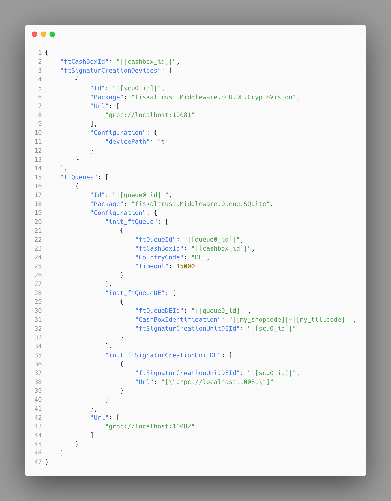

Variablen werden gekennzeichnet indem sie innerhalb von ```|[``` und  ```]|``` angegeben werden. Möglich hierbei ist sowohl die Angabe von [Systemvariablen](#systemvariablen) deren Werte vom fiskaltrust System bei der Generierung erzeugt werden als auch die Angabe eigener Variablen deren Werte später über einen API Aufruf zum Generieren der CashBox übergeben werden können (siehe auch [Parametrisierung des API Aufrufs](#parametrisierung)). 

In Zeile 1 des obigen Beispiel wird die Systemvariable: ```|[cashbox_id]|```  als Wert für ```"ftCashBoxId"``` angegeben. Hierbei geht es um die CashBoxID, einem Wert, der automatisch von dem System erzeugt wird und beim Generieren der CashBox an dieser Stelle eingesetzt wird.

In Zeile 31 werden hingegen eigene Variablen verwendet (```|[my_shopcode]|``` und ```|[my_tillcode]|``` ) deren konkrete Werte später beim API Aufruf übergeben werden können. 

Wie ebenfalls in Zeile 31 zu sehen ist, können die JSON String Werte aus einer Kombination von Variablen und statischen Teilen bestehen. Sie können aber auch nur statischen "Text" beinhalten oder auch nur eine Variable.

Folgende Tabellen zeigen die möglichen Inhalte (Datenstruktur) eines Template:

| **Fieldname**        | **Pflicht**              | **Inhalt**          | **Beschreibung**          |
|----------------------|--------------------------|--------------------------|---------------------|
| `ftCashBoxId` |ja | ```GUID String``` | Identifiziert die Cashbox im fiskaltrust System und muss daher eindeutig sein. Wird später ein Teil der Authentifizierung der Registrierkasse mit fiskaltrust. Die Systemvariable ```|[cashbox_id]|```  kann hier verwendet werden um den Wert bei Generierung der Cashbox von fiskaltrust automatisch zu erzeugen und einzusetzen. |
| `ftSignaturCreationDevices` |nein | `PackageConfiguration [ ]` | Array, beinhaltet die Konfigurationen der zu verwendenden SCUs |
| `ftQueues` |nein | `PackageConfiguration [ ]` | Array, beinhaltet die Konfigurationen der zu verwendenden Queues |
| `helpers` |nein | `PackageConfiguration [ ]` | Array, beinhaltet die Konfigurationen der zu verwendenden Helper |
| `TimeStamp` |nein | ```DateTime.UtcNow.Ticks``` | Zeitpunkt der Erstellung des Template|

Ein **`PackageConfiguration`** Objekt ist wie folgt aufgebaut:

| **Fieldname**        | **Pflicht**              | **Inhalt**          | **Beschreibung**          |
|----------------------|--------------------------|--------------------------|---------------------|
| `Id` |ja |  ```GUID String```  | Identifiziert die Instanz des Elements, das hier konfiguriert wird (SCU, Queue oder Helper). Für die Queue kann die Systemvariable `queue{0-9}_id` verwendet werden. Für die SCU kann hier die Systemvariable `scu{0-9}_id` zum Einsatz kommen. Für Helper  `helper{0-9}_id`. |
| `Package` |ja | ```String``` | Name des Package das zum Erstellen des Elements verwendet werden soll. Z.B. `fiskaltrust.Middleware.SCU.DE.CryptoVision` für eine SCU, die mit einer Cyptovision-TSE kommunizieren soll. Aktuell unterstützte Packages finden sie weiter unten. |
| `Description` |nein |  ```String```| Name des Elements. Z.B. der Queue oder SCU |
| `Version` |nein |  ```String```| Version des Package das zum Erstellen des Elements verwendet werden soll. Wenn keine Version angegeben wird, so wird die neueste Version verwendet.|
| `Configuration` |nein | `<String, Object>`| Konfigurationsparameter des Elements. Z.B. Laufwerkbuchstabe der TSE bei der Cryptovision SCU, damit der SCU bekannt ist wie sie auf die TSE zugreifen soll. Je nach Element-Typ zu befüllen. Siehe unten. |
| `URL` |ja | `String []` | Array, Kommunikationsendpunkte des Elements. Z.B. REST Endpunkt für die Kommunikation mit der Queue. |

**Queue**
Folgende Packages stehen aktuell für Queues zur Verfügung:

| **Package Name**        | **Beschreibung**          |
|----------------------|----------------------|
| `fiskaltrust.Middleware.Queue.SQLite` |Eine SQLite Datenbank wird als lokaler Persistenzlayer verwendet. |
| `fiskaltrust.Middleware.Queue.EF` |Entity Framework wird als lokaler Persistenzlayer verwendet. |
| `fiskaltrust.Middleware.Queue.MySQL` | Eine MySQL Datenbank wird als lokaler Persistenzlayer verwendet. |

Folgende Schlüssel-Wert Paare werden in dem **`Configuration`** Objekt einer Queue verwendet:

| **Fieldname**        | **Pflicht**              | **Inhalt**          | **Beschreibung**          |
|----------------------|--------------------------|--------------------------|---------------------|
| `init_ftQueue` |ja |  ```Configuration``` | Initialisierungsparameter für die Queue (allgemeiner Teil der Queue Konfiguration).|
| `init_ftQueueDE` |ja |  ```Configuration``` | Initialisierungsparameter für die Queue (länderspezifischer Teil der Queue Konfiguration).|
| `init_ftSignaturCreationUnitDE` |nein |  ```Configuration``` | Initialisierungsparameter zum Verknüpfen der Queue mit einer SCU. Hier werden Verbindungswerte hinterlegt.|
| `connectionstring` |nein |  ```String``` | Verbindungsstring zum Persistenzlayer. Beispiel siehe unten. Bei SQLite kann dieses Feld weggelassen werden wenn keine eigene Datenbank vorhanden ist. In diesem Fall legt fiskaltrust automatisch eine SQLite Datenbank an. |

Beispiel für einen `connectionstring` bei Verwendung von Entity Framework:

`Data Source=.\\!sql-instanz!;Initial Catalog=!fiskaltrust!;User ID=!user!;Password=!password!;MultipleActiveResultSets=True` 

Beispiel für einen `connectionstring` bei Verwendung von MySQL:

`Server=myServerAddress;Database=myDataBase;Uid=myUsername;Pwd=myPassword;` 

Beispiel für einen `connectionstring` bei Verwendung von SQLite:

`Data Source=c:\mydb.db;Version=3;Password=myPassword;` 

Folgende Schlüssel-Wert Paare werden in dem **`Configuration` **Objekt einer Queue im Feld **`init_ftQueue`**  verwendet:

| **Fieldname**        | **Pflicht**              | **Inhalt**          | **Beschreibung**          |
|----------------------|--------------------------|--------------------------|---------------------|
| `ftQueueId` |ja |  ```GUID String``` | Identifikation der Queue. Die Systemvariable `queue{0-9}_id` kann verwendet werden.|
| `ftCashBoxId` |ja |  ```GUID String``` | Identifikation  der Cashbox. Die Systemvariable ```|[cashbox_id]|```  kann hier verwendet werden.|
| `CountryCode` |ja |  ```String``` | Länderkürzel. Für Deutschland: "DE".|
| `Timeout` |nein |  ```Int``` | Timeout in Millisekunden. |

Folgende Schlüssel-Wert Paare werden in dem **`Configuration`** Objekt einer Queue im Feld **`init_ftQueueDE`**  verwendet:

| **Fieldname**        | **Pflicht**              | **Inhalt**          | **Beschreibung**          |
|----------------------|--------------------------|--------------------------|---------------------|
| `ftQueueDEId` |ja |  ```GUID String``` | Identifikation der Queue. Die Systemvariable `queue{0-9}_id` kann verwendet werden. (Hier muss der gleiche Wert wie bei `ftQueueId` verwendet werden.) |
| `CashBoxIdentification` |ja |  ```printable String (20)``` | Kassenseriennummer. Wird auch als Client-ID für die TSE verwendet. Printable String, max. 20 Zeichen.|
| `ftSignaturCreationUnitDEId` |ja |  ```GUID String```  | Die ID der SCU mit der sich diese Queue verbinden soll.|

Folgende Schlüssel-Wert Paare werden in dem **`Configuration`** Objekt einer Queue im Feld **`init_ftSignaturCreationUnitDE`**  verwendet:

| **Fieldname**        | **Pflicht**              | **Inhalt**          | **Beschreibung**          |
|----------------------|--------------------------|--------------------------|---------------------|
| `ftSignaturCreationUnitDEId` |ja |  ```GUID String``` | Identifikation der SCU mit der sich diese Queue verbinden soll. Die Systemvariable `scu{0-9}_id` kann verwendet werden. |
| `Url` |ja |  ```String``` | Kommunikationsendpunkte der SCU. Als Array im String Bsp: ```"[\"grpc://localhost:10081\", \"grpc://localhost:10082\"]"```. Normalerweise wird nur ein Endpunkt benötigt. |

**SCU**

Folgende Packages stehen aktuell für SCUs zur Verfügung:

| **Package Name**        | **Beschreibung**          |
|----------------------|----------------------|
| `fiskaltrust.Middleware.SCU.DE.CryptoVision` | Dieses Package ermöglicht die Kommunikation mit einer Cryptovision TSE.|
| `fiskaltrust.Middleware.SCU.DE.DieboldNixdorf` | Dieses Package ermöglicht die Kommunikation mit einer Diebold Nixdorf TSE.|
| `fiskaltrust.Middleware.SCU.DE.Epson` | Dieses Package ermöglicht die Kommunikation mit einer Epson TSE.|
| `fiskaltrust.Middleware.SCU.DE.Fiskaly` | Dieses Package ermöglicht die Kommunikation mit eine Fiskaly TSE.|
| `fiskaltrust.Middleware.SCU.DE.Swissbit` | Dieses Package ermöglicht die Kommunikation mit einer Swissbit TSE. |

Folgende Schlüssel-Wert Paare werden in dem **`Configuration`** Objekt einer **SCU** je nach Hersteller der TSE verwendet:

**Swissbit TSE**

| **Fieldname**        | **Pflicht**              | **Inhalt**          | **Beschreibung**          |
|----------------------|--------------------------|--------------------------|---------------------|
| `devicePath` |ja |  ```String``` | Laufwerksbuchstabe gefolgt von Doppelpunkt (z.B. `E:`). Repräsentiert das Laufwerk an dem die Swissbit TSE an der Kasse angeschossen wird. |
| `adminPin` |nein |  ```String``` | Admin PIN. Nur anzugeben wenn es sich um eine außerhalb von fiskaltrust initialisierte TSE handelt. Falls die TSE noch nicht initialisiert ist, wird dieser Wert nicht benötigt.|
| `timeAdminPin` |nein |  ```String``` | Time Admin PIN. Nur anzugeben wenn es sich um eine außerhalb von fiskaltrust initialisierte TSE handelt. Falls die TSE noch nicht initialisiert ist, wird dieser Wert nicht benötigt.|

**Cryptovision TSE**

| **Fieldname**        | **Pflicht**              | **Inhalt**          | **Beschreibung**          |
|----------------------|--------------------------|--------------------------|---------------------|
| `devicePath` |ja |  ```String``` | Laufwerksbuchstabe gefolgt von Doppelpunkt (z.B. `E:`). Repräsentiert das Laufwerk an dem die Cryptovision TSE an der Kasse angeschossen wird. |
| `adminPin` |nein |  ```String``` | Admin PIN. Nur anzugeben wenn es sich um eine außerhalb von fiskaltrust initialisierte TSE handelt. Falls die TSE noch nicht initialisiert ist, wird dieser Wert nicht benötigt.|
| `timeAdminPin` |nein |  ```String``` | Time Admin PIN. Nur anzugeben wenn es sich um eine außerhalb von fiskaltrust initialisierte TSE handelt. Falls die TSE noch nicht initialisiert ist, wird dieser Wert nicht benötigt.|

**Diebold Nixdorf**

| **Fieldname**        | **Pflicht**              | **Inhalt**          | **Beschreibung**          |
|----------------------|--------------------------|--------------------------|---------------------|
| `comPort` |ja (nur USB) |  ```String``` | Definiert den Com Anschluß an, an dem die TSE angeschlossen wird. Zum Beispiel `COM6`. Nur zu verwenden wenn es sich um eine USB-TSE ohne Connect Box handelt. |
| `url` |ja (nur Connect Box) |  ```String``` | Verbindungs-Url falls es sich um eine Diebold Nixdorf Connect Box handelt. |
| `adminUser` |nein |  ```String``` | Admin Username. Nur anzugeben wenn es sich um eine außerhalb von fiskaltrust initialisierte TSE handelt. Falls die TSE noch nicht initialisiert ist, wird dieser Wert nicht benötigt.|
| `adminPin` |nein |  ```String``` | Admin PIN. Nur anzugeben wenn es sich um eine außerhalb von fiskaltrust initialisierte TSE handelt. Falls die TSE noch nicht initialisiert ist, wird dieser Wert nicht benötigt.|
| `timeAdminUser` |nein |  ```String``` | Time Admin Username. Nur anzugeben wenn es sich um eine außerhalb von fiskaltrust initialisierte TSE handelt. Falls die TSE noch nicht initialisiert ist, wird dieser Wert nicht benötigt.|
| `timeAdminPin` |nein |  ```String``` | Time Admin PIN. Nur anzugeben wenn es sich um eine außerhalb von fiskaltrust initialisierte TSE handelt. Falls die TSE noch nicht initialisiert ist, wird dieser Wert nicht benötigt.|
| `slotNumber` |ja (nur Connect Box) |  ```Int``` | Slot-Nummer der TSE falls hierbei eine Diebold Nixdorf Connect Box verwendet wird. |

**Epson** 

| **Fieldname**        | **Pflicht**              | **Inhalt**          | **Beschreibung**          |
|----------------------|--------------------------|--------------------------|---------------------|
| `tseurl` |ja |  ```String``` | Url zum Verbinden mit der TSE. Hier wird die TSE erreichbar sein |
| `tseport` |nein |  ```String``` | Port zum Verbinden mit der TSE. Hier wird die TSE erreichbar sein|
| `deviceid` |nein |  ```String``` | Device Id beim Epson Server.|
| `timeout` |nein | Int | Timeout in Millisekunden |

**Fiskaly**

| **Fieldname**        | **Pflicht**              | **Inhalt**          | **Beschreibung**          |
|----------------------|--------------------------|--------------------------|---------------------|
| `apiKey` |ja |  ```String``` | Fiskaly API Schlüssel |
| `apiSecret` |ja |  ```String``` | Fiskaly API Secret |
| `tssId` |ja |  ```GUID String``` | ID der TSE von Fiskaly |

#### Systemvariablen

Folgende Systemvariablen stehen Ihnen zur Verwendung im Template zur Verfügung:

| Variable                                  | Wert                                                         |
| ----------------------------------------- | ------------------------------------------------------------ |
| `cashbox_id`                              | Random GUID                                                  |
| `scu{0-9}_id`                             | Random GUID                                                  |
| `helper{0-9}_id`                          | Random GUID                                                  |
| `queue{0-9}_id`                           | Random GUID                                                  |
| `queue{0-9}_id_base64withoutspecialchars` | `{queue_id}`, converted to Base64 without special characters |

_Dynamische Werte werden in dieser Tabelle durch {} hervorgehoben._


#### Zur Verfügung stellen des Konfigurations-Template über das Portal

KassenHersteller, KassenHändler und KassebBetreiber können Konfigurations-Templates im fiskaltrust.Portal ablegen und freigeben. Dies können sie unter dem Menüpunkt `Konfiguration->Templates` vornehmen. 

Das Template selbst (JSON String) wird dabei im das Formularfeld `Content`  hinterlegt.

Beim Anlegen des Template kann gewählt werden an welche Zielgruppe das Template freigegeben werden soll. 

Optionen für **KassenHersteller**:

| **Option**        | **Beschreibung**          |
|----------------------|----------------------|
| `Deaktiviert` | Keine Freigabe, Template befindet sich noch in Vorbereitung oder wurde pausiert. |
| `Privat (nur Besitzer)` | Freigabe nur für dem Kassenhersteller selbst (z.B. zum Testen) |
| `Geteilt mit Händler` | Freigabe für den Kassenhersteller selbst und für alle mit ihm verbundenen Kassenhändler. |
| `Getielt mit Betreiber` | Freigabe für den Kassenhersteller selbst und für alle mit seinen Kassenhändler verbundenen Kassenbetreiber.|

Optionen für **KassenHändler**:

| **Option**        | **Beschreibung**          |
|----------------------|----------------------|
| `Deaktiviert` | Keine Freigabe, Template befindet sich noch in Vorbereitung oder wurde pausiert. |
| `Privat (nur Besitzer)` | Freigabe nur für dem Kassenhändler selbst (z.B. zum Testen). |
| `Getielt mit Betreiber` | Freigabe für den Kassenhändler selbst und für alle mit ihm verbundenen Kassenbetreiber.|

Optionen für **KassenBetreiber**:

| **Option**        | **Beschreibung**          |
|----------------------|----------------------|
| `Deaktiviert` | Keine Freigabe, Template befindet sich noch in Vorbereitung oder wurde pausiert. |
| `Privat (nur Besitzer)` | Freigabe nur für dem Kassenbetreiber selbst. |

Des Weiteren kann das Template mit einem Bild und Link personalisiert werden. Da später das Template im fiskaltrust.Webshop für freigegebene Accounts erscheint, wird durch dieses Branding eine bessere Erkennung ermöglicht.

Stellt der KassenHersteller ein Template für seine KassenHändler zur Verfügung, so können diese das Template klonen, eventuell anpassen und als neues Template ihren KassenBetreibern zur Verfügung stellen.


#### Manuelles Ausführen des Konfigurations-Template

Sobald ein Template für einen Account freigeben wurde, so erscheint dieses als kostenloses Produkt im fiskaltrust.Shop innerhalb des freigegebenen Account. Der Account-Besitzer kann das Template nun in beliebiger Menge auschecken. Die Menge stellt dabei die Anzahl der CashBoxen dar, die automatisch generiert werden sollen. Sobald der Checkout-Prozess abgeschlossen ist, wird vom Portal durch Anwendung des Templates die entsprechende Anzahl von CashBoxen automatisch generiert und im Account bei den Konfigurationen hinterlegt (Menüpunkt: `Konfiguration->CashBox`). 

Handelt es sich hierbei um den Account eines KassenBetreibers, besteht die Möglichkeit je nach Outlet unterschiedliche Templates auszuchecken. Deshalb sollte vor der Übernahme des Templates in den Warenkorb auf die Standortauswahl geachtet werden (Auswahl: Standort-Dropdown oben links im Shop).

Unter bestimmten Umständen kann der KassenHändler selbst für den KassenBetreiber das Auschecken des Template vornehmen. Dies stellt eine zeitsparende Optimierung dar, die es KassenHändlern ermöglicht beim Rollout ohne das Zutun des KassenBetreibers zu operieren. Dafür benötig jedoch der KassenHändler eine generelle Erlaubnis des KassenBetreibers zur sog. "Surrogating Funktion". Mit dieser Funktion kann der KassenHändler in den Account des KassenBetreiber switchen.

#### FAQ: Template nur für einen Kunden

Eine häufig gestellte Frage in diesem Kontext ist, ob ein Template auch nur für einen bestimmten Endkunden (KassenBetreiber) zur Verfügung gestellt werden kann. Um dies zu erreichen, kann der KassenHändler mit der "Surrogating Funktion" in den Account des KassenBetreiber wechseln und dort unter das Template anlegen und mit der Freigabestufe `Privat (nur Besitzer)` freigeben. Somit wird dieses Template über den fiskaltrust.Shop nur im Account dieses KassenBetreibers sichtbar.


#### Nutzung von API oder PowerShell zum automatisierten Ausführen der Templates


fiskaltrust stelle eine HTTP-API zur Verfügung mit der Sie die Automatisierung der CashBoxgenerierung mit Hilfe von Konfigurations-Templates vornehmen können. Im diesem Kapitel wird die API beschrieben und ein Aufruf am Beispiel PowerShell vorgeführt.

#### API
Die Ausführung von Templates kann über unsere HTTP-API leicht automatisiert werden. Sie benötigen dazu das Template als JSON String, die AccountId und den AccessToken des Accounts (z.B. des KassenBetreibers) für den das Template ausgeführt werden soll. AccountId und Accesstoken finden Sie im fiskaltrust.Portal innerhalb des entsprechenden Account (Menüpunkt: [`Firmanname -> Übersicht`](https://portal.fiskaltrust.de/AccountProfile) im unteren Bereich befindet sich die Sektion `API Zugriff`).


Ihr Request sollte wie folgt aussehen:

- _Method_: **POST**
- _Headers_: 
  - `accountid`: `<your-account-id>`
  - `accesstoken`: `<your-access-token>`
- _Body_: JSON template
- _URLs_: 
  - Sandbox: `https://helipad-sandbox.fiskaltrust.cloud/api/configuration`
  - Production: `https://helipad.fiskaltrust.cloud/api/configuration`

#### Parametrisierung

Zusätzlich können Variablen zum Query-String der URL hinzugefügt werden, die dann automatisch im Template ersetzt werden.  Ändern Sie beispielsweise die obige URL auf den Wert:

`https://helipad.fiskaltrust.cloud/api/configuration?my_variable=123` 

so werden vor dem Ausführen des Template die Vorkommnisse `|[my_variable]|` mit dem String  `123`  ersetzt.

Falls nicht über den Query-String überschrieben, werden [Systemvariablen](#systemvariablen) im Template wie oben beschrieben automatisch vom System ersetzt.

Des Weiteren besteht die Möglichkeit folgende zusätzliche (optionale) Parameter über den Query-String der URL zu übergeben:

| Variable                 | Beschreibung                                                 | Default Wert falls nicht übergeben                        |
| ------------------------ | ------------------------------------------------------------ | --------------------------------------------------------- |
| `outlet_number`          | Nummer des Standorts                                         | `{max(outlets used in account's existing cashboxes) + 1}` |
| `description`            | Name allgemein. Wird für die Cashbox, enthaltene Queues und SCUs verwendet, falls nicht einzeln mit eigenem Parameter überschrieben. | `ft{yyyyMMddHHmmss}`                                      |
| `cashbox_description`    | Name für die Cashbox. Überschreibt  `description`            | `ft{yyyyMMddHHmmss}`                                      |
| `cashbox_id`             | ID der Cashbox. Kann bei Neuanlage und bei Änderung verwendet werden. Bei Neuanlage empfehlen wir diesen Parameter nicht anzugeben und dessen automatische Generierung dem fiskaltrust System zu überlassen. Achtung: wird vom Template-Feld  `ftCashBoxId` überschrieben. | Random GUID                                               |
| `cashbox_ipaddress`      | IP Adresse der Cashbox.                                      | Empty string                                              |
| `cashbox_producttype`    | Cashbox Product Type                                         | Empty string                                              |
| `queue{0-9}_id`          | ID der Queue. Kann bei Neuanlage und bei Änderungen verwendet werden. Bei Neuanlage empfehlen wir diesen Parameter nicht anzugeben und dessen automatische Generierung dem fiskaltrust System zu überlassen. Achtung: wird vom Template-Feld  `PackageConfiguration.Id` überschrieben. | Random GUID                                               |
| `queue{0-9}_description` | Name für die Queue. Überschreibt  `description`. Achtung: wird von `PackageConfiguration.Description`  überschrieben. | `{description}`                                           |
|`queue{0-9}_package` |  Name des Package zum Erstellen der Queue. Achtung: wird von `PackageConfiguration.Package`  überschrieben. | Empty String |
|`queue{0-9}_version` |  Version des Package zum Erstellen der Queue. Achtung: wird von `PackageConfiguration.Version`  überschrieben. | Empty String |
| `queue{0-9}_url` | JSON Array mit URLs (Strings) für die Queue. Achtung: wird von `PackageConfiguration.Url`  überschrieben.  | `http://localhost:1200/fiskaltrust` for the first queue, `http://localhost:1200/fiskaltrust{1-9}` for others |
| `queue{0-9}_configuration` | JSON Element zur Konfiguration der Queue. Wie   `PackageConfiguration.Configuration`  aus dem Template. Achtung: wird von `PackageConfiguration.Configuration`  überschrieben. | Empty |
| `queue{0-9}_countrycode` | Länderkürzel für die Queue. Wie   `PackageConfiguration.Configuration.CountryCode`  aus dem Template. Achtung: wird von `PackageConfiguration.Configuration.CountryCode`  überschrieben.  | Empty |
| `queue{0-9}_timeout` | Timeout für die Queue. Wie   `PackageConfiguration.Configuration.Timeout`  aus dem Template. Achtung: wird von `PackageConfiguration.Configuration.Timeout`  überschrieben.  | 15000 |
| `scu{0-9}_id`                            | ID der SCU. Kann bei Neuanlage und bei Änderungen verwendet werden. Bei Neuanlage empfehlen wir diesen Parameter nicht anzugeben und dessen automatische Generierung dem fiskaltrust System zu überlassen. Achtung: wird vom Template-Feld  `PackageConfiguration.Id` überschrieben. | Random GUID                                                  |
| `scu{0-9}_description`                   | Name für die SCU. Überschreibt  `description` . Achtung: wird von `PackageConfiguration.Description`  überschrieben. | `{description}`                                              |
|`scu{0-9}_package` |  Name des Package zum Erstellen der SCU. Achtung: wird von `PackageConfiguration.Package`  überschrieben. | Empty String |
|`scu{0-9}_version` |  Version des Package zum Erstellen der SCU. Achtung: wird von `PackageConfiguration.Version`  überschrieben. | Empty String |
| `scu{0-9}_url` | JSON Array mit URLs (Strings) für die SCU. Achtung: wird von `PackageConfiguration.Url`  überschrieben.  | `net.pipe://localhost/{scu_id}` |
| `scu{0-9}_configuration` | JSON Element zur Konfiguration der SCU. Wie   `PackageConfiguration.Configuration`  aus dem Template. Achtung: wird von `PackageConfiguration.Configuration`  überschrieben. | Empty |
| `helper{0-9}_id`                         | ID des Helper. Kann bei Neuanlage und bei Änderungen verwendet werden. Bei Neuanlage empfehlen wir diesen Parameter nicht anzugeben und dessen automatische Generierung dem fiskaltrust System zu überlassen. Achtung: wird vom Template-Feld  `PackageConfiguration.Id` überschrieben. | Random GUID                                                  |
| `helper{0-9}_description`                | Name für den Helper. Überschreibt  `description` . Achtung: wird von `PackageConfiguration.Description`  überschrieben.  | `{description}`                                              |
| `helper{0-9}_url`                        | JSON Array mit URLs (Strings) für den Helper. Achtung: wird von `PackageConfiguration.Url`  überschrieben.  | `net.pipe://localhost/{helper_id}`                           |
|`helper{0-9}_package` |  Name des Package zum Erstellen des Helper. Achtung: wird von `PackageConfiguration.Package`  überschrieben. | Empty String |
|`helper{0-9}_version` |  Version des Package zum Erstellen des Helper. Achtung: wird von `PackageConfiguration.Version`  überschrieben. | Empty String |
| `helper{0-9}_configuration` | JSON Element zur Konfiguration des Helper. Wie   `PackageConfiguration.Configuration`  aus dem Template. Achtung: wird von `PackageConfiguration.Configuration`  überschrieben.  | Empty |


Bsp:

`https://helipad-sandbox.fiskaltrust.cloud/api/configuration?outlet_number=55&description=Mdedarh999&queue0_description=Mdedarh999_Q1&queue1_description=Mdedarh999_Q2&queue2_description=Mdedarh999_Q3`

#### Antwort

Als Antwort gibt die API einen JSON String zurück, der die `cashboxid` der angelegten CashBox, den `accesstoken` und das Template beinhaltet. Die erhaltene `cashboxid` ist wichtig für die vollständige Automatisierung des Rollout. Siehe dazu auch [Automatisierter Rollout der fiskaltrust.Middleware](#automatisierter-rollout-der-fiskaltrust.middleware).

#### PowerShell

Das folgende Beispiel zeigt wie mit Hilfe der PowerShell der Request an unsere API gesendet werden kann:

```powershell
$headers = @{ accountid = "your-account-id" ; accesstoken = "your-access-token" }
$uri = "https://helipad-sandbox.fiskaltrust.cloud/api/Configuration"
# Read from template.json and escape JSON string
$template = (Get-Content .\template.json -Raw).Replace('\', '\\').Replace('"', '\"')

Invoke-WebRequest -uri  $uri -Headers $headers -Method POST -ContentType "application/json" -Body "`"$template`""
```

#### Handling von Standorten/Outlets

Wie weiter oben bereits erwähnt, kann das Auschecken von Templates mit dem Standort des KassenBetreibers verknüpft werden. In diese Kapitel wird aufgezeigt wie diese Funktion automatisiert über die API vrogenommen werden kann.

##### Anlegen oder Importieren der Outlets im Portal

Standorte (sogenannte Outlets) können manuell über das Portal im Account des KassenBetreibers angelegt werden. Siehe Menüpunkt `Outlets` . Des Weiteren kann als Optimierungsvariante unter dem selben Menüpunkt mit Hilfe einer csv. Datei eine ganze Liste von Standorten importiert werden. Der Aufbau einer solchen Liste ist im Portal beschrieben.

Das Anlegen der Standorte ist nur über das Portal möglich und kann nicht über die API erfolgen.

##### Angabe des Outlets im API Aufruf

Über den Parameter `outlet_number` kann im Query-String die Outlet-Nummer angebenen werden für die das Template ausgeführt werden soll:

`https://helipad-sandbox.fiskaltrust.cloud/api/configuration?outlet_number=12`

##### Beispiel automatisiertes Ausführen verschiedener Templates unter Berücksichtigung der Outlets

Powershell:

```powershell
$headers = @{ accountid = "your-account-id" ; accesstoken = "your-access-token"  }

$outlets = Import-Csv -Path .\fiskaltrustOutletsWithTemplateFile.csv -Delimiter ';'

foreach ($outlet in $outlets)
{
    $template = (Get-Content .\$($outlet.Template) -Raw).Replace('\', '\\').Replace('"', '\"')

    $uri = "https://helipad-sandbox.fiskaltrust.cloud/api/configuration?description=$([uri]::EscapeDataString($outlet.Name))&outlet_number=$([uri]::EscapeDataString($outlet.OutletNumber))&my_shopcode=$($outlet.OutletNumber)&my_tillcode=$($outlet.TillCode)"

    Write-Output $uri
    Invoke-WebRequest -uri  $uri -Headers $headers -Method POST -ContentType "application/json" -Body "`"$template`""
}
```
Schritt 1: Header definieren (accountId und accesstoken setzen)

Schritt 2: Outlets aus der [`fiskaltrustOutletsWithTemplateFile.csv`](media/fiskaltrustOutletsWithTemplateFile.csv) Datei einlesen. Diese Datei wird sowohl für das Anlegen der Outlets (Import im Portal) als auch zum Ausführen der Templates verwendet. Nach dem Import im Portal wird sie hier eingelesen. Beispielhafter Inhalt:

`
LocationId;OutletNumber;Name;Address;ContactName;Telephone;Fax;PostalCode;City;County;StateOrProvince;Country;Template;TillCode
;15;Outlet 5;street address5;;;;80803;München;;;DE;template1.json;till1
;16;Outlet 6;street address6;;;;80803;München;;;DE;template2.json;till2
;17;Outlet 7;street address7;;;;80803;München;;;DE;template1.json;till3
`

Schritt 3: Iteration über die eingelesenen Zeilen aus der Outlet Datei.

Schritt 4: für jede eingelesene Zeile wird das entsprechende Template eingelesen und vorbereitet. Z.B. für Zeile 1 wird der Inhalt der Datei [`template1.json`](media/template1.json) eingelesen. In Zeile 2 wird für ein anderes Outlet ein anderes Template [`template2.json`](media/template2.json) benötigt.

Schritt 5: für jede eingelesene Zeile wird die Uri für den API Aufruf aufgebaut. Hierbei wird die Outlet Nummer als Parameter im Query-String übergeben.

Schritt 6: für jede eingelesene Zeile wird ein Aufruf der HTTP-API mit dem zuvor vorbereiteten Header, Uri und Template abgesetzt.

Zusammenfassung: In dem obigen Beispiel wurden mit Hilfe der [`fiskaltrustOutletsWithTemplateFile.csv`](media/fiskaltrustOutletsWithTemplateFile.csv) Datei sowohl die Outlets im Portal angelegt (Bulk-Import) als auch für jedes Outlet das dazugehörige Template (einmalig - als Beispiel) ausgeführt.

### Automatisierter Rollout der fiskaltrust.Middleware

Über das fiskaltrust.Portal haben Sie die Möglichkeit den Launcher herunterzuladen. Drücken Sie dazu den "Download online Launcher" Button einer beliebigen Cahsbox im Portal. Den heruntergeladenen Launcher können Sie nun als Teil Ihres Rollouts automatisiert auf alle Kassen der Betreiber ausliefern und starten. 

Wichtig ist es hierbei beim ersten Start darauf zu achten, dass die fiskaltrust.Middleware richtig, d.h. mit der dazugehörigen CashBox initialisiert wird. Dafür stellt der Launcher ein Konfigurationsfile (fiskaltrust.exe.config) zur Verfügung. Dieses können Sie vor dem Ausrollen des Launcher auf die Kasse des Betreibers entsprechend anpassen. 

Bitte geben Sie dazu in dem Bereich `appSetting` die Werte für `cashboxid` und `accesstoken` an. Diese Werte erhalten Sie als Rückgabewerte des [API Aufruf](#antwort) zum Ausführen des Konfigurations-Template.

```xml
<configuration>
<appSettings>
  <add key="cashboxid" value="your-cashbox-id" />
  <add key="accesstoken" value="your-access-token" />
```
Nun können Sie den Launcher mit der angepassten Konfigurationsdatei auf die Kasse des Betreibers ausliefern und mit `fiskaltrust.exe` starten. Der Launcher wird sich automatisch die CashBox (Konfigurationscontainer) zur in `fiskaltrust.exe.config` angegebenen `cashboxid`  vom fiskaltrust Server herunterladen und die fiskaltrust.Middleware entsprechend konfigurieren und starten.

Alternativ zur Anpassung der Konfiguration in der`fiskaltrust.exe.config` Datei können Sie beim Starten des Launcher (`fiskaltrust.exe` ) die `cashboxid` und den `accesstoken` als Parameter übergeben. Diese Angabe überschreibt die vorhandene Konfiguration. Die Beschreibung der möglichen Start-Parameter fnden sie [hier](https://github.com/fiskaltrust/interface-doc/blob/master/doc/general/installation/installation.md).

#### Hoher Automatisierungsgrad

Durch die oben beschriebene Vorgehensweisen zum Ausführen der Konfigurations-Templates über die API und zum automatisierten Rollout der fiskaltrust.Middleware ist ein hoher Automatisierungsgrad des Rollouts erreichbar. Lediglich die Outlets müssen mit Hilfe des Bulk-Import im Portal manuell angelegt werden.
